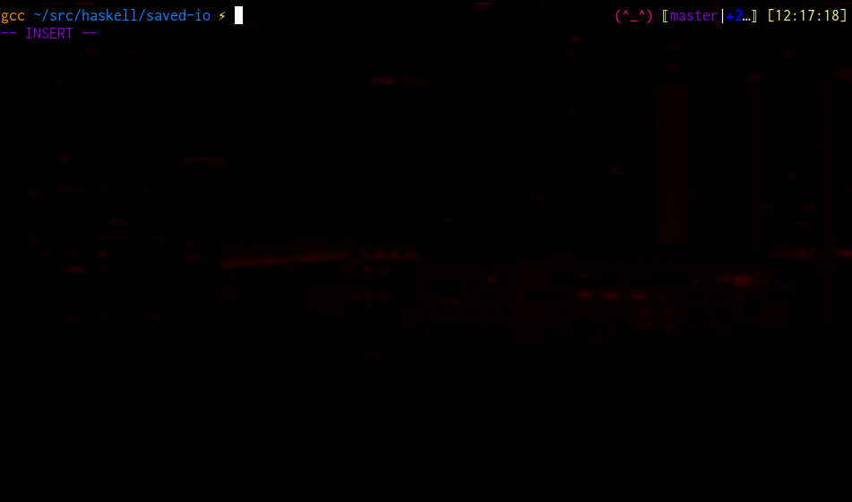

Overview
========

saved.io is a cloud-based bookmarking site.  Go to http://saved.io/about for
more information.

This project is not affiliated with the saved.io website or its developers.

I wrote this project to fulfil a simple desire: I wanted a command line
interface to create and query saved.io bookmarks.  Fortunately, saved.io
provides an API that allows one to write their own tools.

This project provides:

- A command line tool to interface with the saved.io server.
- A Haskell library that wraps the saved.io API.

Screenshot
==========


Installation
============
 1. Install stack (https://docs.haskellstack.org/en/stable/README/)
 2. `stack config`  -- first time only
 3. `stack build`
 4. `stack test`    -- optional, if you want to run the tests
 5. `stack install` -- optional, if you want install it

Setup
=====
 1. Generate a developer API key at http://devapi.saved.io/key/.
 2. Generate a user key at http://saved.io/key.


Usage (Command Line Tool)
=========================

Printing Help
----------------
`saved-io --help`

```
Available options:
  -h,--help                Show this help text
  -v,--version             Display version
  -d,--devkey DEVKEY       Saved.io developer key. See
                           http://devapi.saved.io/key
  -u,--userkey USERKEY     Saved.io user key. See http://saved.io/key
  -f,--format BMFORMAT     id,title,url,note,creation
  -c,--color               Enable color output
  -b,--no-color            Disable color output
  --limit N                Limit to N results
  -s,--sort                Sort output
  -n,--no-sort             Do not sort output
  --sort-method SORT-DIRECTION
                           ascending|descending

Available commands:
  list                     List bookmark groups
  search                   Search for bookmark
  addmark                  Add bookmark
  delmark                  Delete bookmark
  getmark                  Get bookmark
  mkrc                     Make RC File
```

Creating a RC file
------------------
Creating a RC file allows you to save the following settings:

 - Dev key
 - User key
 - Bookmark display format
 - Sorting preference
 - Result limit (upper bound on number of results returned)

### To create a rc file with your devkey and user key
`saved-io --devkey YOURDEVKEY --userkey YOURUSERKEY mkrc > ~/.saved-io.rc`

### To create a rc file with all the settings
`saved-io --devkey YOURDEVKEY --userkey YOURUSERKEY --format title,url --color --limit 1000 --sort mkrc > ~/.saved-io.rc`

Adding a bookmark
-----------------
### Basic example
`saved-io addmark --title "Cool website" --url "www.github.com"`

### Optionally, bookmarks can be added to specific groups
`saved-io addmark --title "Cool website" --url "www.github.com" --group "development"`

Deleting a bookmark
-------------------
Bookmarks are deleted by ID.  The bookmark ID can be queried via list and
search commands, ensuring that `--format` contains the `id` field.

`saved-io delmark Z6ek8`

Fetching a single bookmark
--------------------------
Bookmarks can be fetched by id as well.

`saved-io getmark Z6ek8`

Note that the same effect can be achieved with search as well, although it may
slower as the search is done on the client side:

`saved-io search -/id Z6ek8`

Listing bookmarks
-----------------
### List all bookmarks (potentially bounded by --limit)
`saved-io list`

### List all bookmarks within a group "development"
`saved-io list development`

Searching bookmarks
-------------------
### Find all bookmarks with "git" in the title
`saved-io search git`

### Find all bookmarks with "git" in the url
`saved-io search -/url git`

The --type ('-/') option supports the following search categories:

 - id  -- The bookmark ID
 - url
 - title
 - note
 - creation -- The creation date in the format YYYY-MM-DD

Formatting the output
---------------------
The output can be controlled by the '--format', '--color', and '--limit' option.

### --format
The --format option can takes zero or more comma separate strings from the following set:

 - id
 - title
 - url
 - note
 - creation

If you wanted to see everything for example:
`saved-io list --format id,title,url,note,creation`

If you wanted to see only the url, repeated twice for some reason:

`saved-io list --format url,url`

### --color
This option enables color output.  Disable with '--no-color'.

### --limit
Limits the number of entries shown.

Using the library
=================
See the Haddock documentation.

Limitations
===========
 * The saved.io v2 API provides no way to query or show the bookmark groups.
   (v1 did provide it.)
 * It is not possible to edit existing bookmarks.
